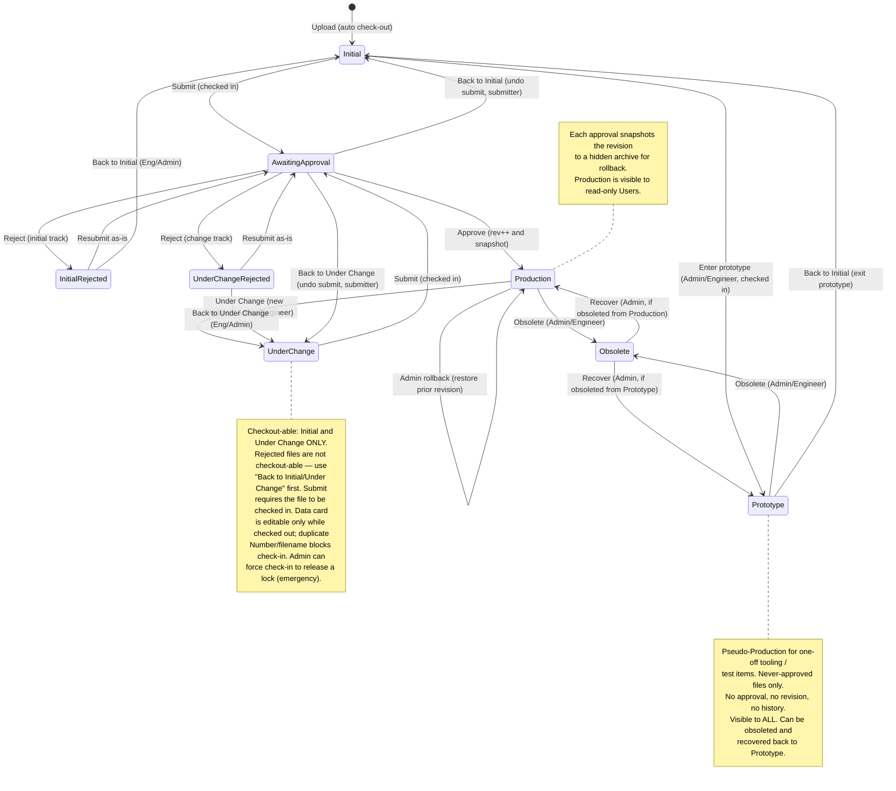

```mermaid
%% Vault PDM — File Workflow (v3.5)
%% Keep this in sync with the project whenever the workflow changes.
%% v3.5: "Back to Initial/Under Change" (undo submit from Awaiting, OR return a rejected file to
%% editable) replaces the old withdraw/reopen — no approver notification. Obsolete is reachable
%% from Production OR Prototype; Recover (Admin) restores the EXACT prior state. Every state change
%% needs a confirmation dialog; data card is editable only while checked out; duplicate Number or
%% filename blocks check-in. UI labels in docs/ui-commands.md; revisions are automatic.
stateDiagram-v2
    [*] --> Initial: Upload (auto check-out)
    Initial --> AwaitingApproval: Submit (checked in)
    InitialRejected --> AwaitingApproval: Resubmit as-is
    InitialRejected --> Initial: Back to Initial (Eng/Admin)
    AwaitingApproval --> InitialRejected: Reject (initial track)
    AwaitingApproval --> Initial: Back to Initial (undo submit, submitter)
    AwaitingApproval --> Production: Approve (rev++ and snapshot)
    Production --> UnderChange: Under Change (new revision, Admin/Engineer)
    Production --> Obsolete: Obsolete (Admin/Engineer)
    Prototype --> Obsolete: Obsolete (Admin/Engineer)
    Obsolete --> Production: Recover (Admin, if obsoleted from Production)
    Obsolete --> Prototype: Recover (Admin, if obsoleted from Prototype)
    UnderChange --> AwaitingApproval: Submit (checked in)
    UnderChangeRejected --> AwaitingApproval: Resubmit as-is
    UnderChangeRejected --> UnderChange: Back to Under Change (Eng/Admin)
    AwaitingApproval --> UnderChangeRejected: Reject (change track)
    AwaitingApproval --> UnderChange: Back to Under Change (undo submit, submitter)
    Production --> Production: Admin rollback (restore prior revision)
    Initial --> Prototype: Enter prototype (Admin/Engineer, checked in)
    Prototype --> Initial: Back to Initial (exit prototype)
    note right of UnderChange
      Checkout-able: Initial and Under Change ONLY.
      Rejected files are not checkout-able — use
      "Back to Initial/Under Change" first. Submit
      requires the file to be checked in. Data card
      is editable only while checked out; duplicate
      Number/filename blocks check-in. Admin can
      force check-in to release a lock (emergency).
    end note
    note left of Production
      Each approval snapshots the revision
      to a hidden archive for rollback.
      Production is visible to read-only Users.
    end note
    note right of Prototype
      Pseudo-Production for one-off tooling /
      test items. Never-approved files only.
      No approval, no revision, no history.
      Visible to ALL. Can be obsoleted and
      recovered back to Prototype.
    end note
```
